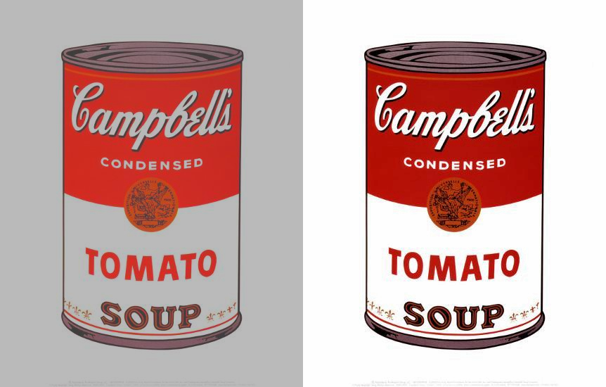

# Images contrast adjuster

Multithreaded contrast adjuster written in the C.
The program takes an image in ppm format and exposes white and black points.
It uses openmp to process images in parallel on multiple threads.

## Examples




## Algorithm
1. Convert image from [RGB](https://en.wikipedia.org/wiki/RGB_color_model) to [YCbCr](https://en.wikipedia.org/wiki/YCbCr)
2. Find pixels with min and max brightness
3. Linear adjusting brightness from [min, max] to [0, 255]
1. Convert image from [YCbCr](https://en.wikipedia.org/wiki/YCbCr) to [RGB](https://en.wikipedia.org/wiki/RGB_color_model) 

## Benchmark
Due to multithreading, image processing on a 4-core processor is accelerated by 3.7 times.
The best time is observed when the number of threads is equal to the number of cores.

Test system: AMD Ryzen 3 2200G, 4 cores, 4 threads

| Threads | Average time, ms |
|--------:|-----------------:|
|       1 |             1268 |
|       2 |              698 |
|       3 |              480 |
|       4 |              322 |
|       5 |              409 |
|       6 |              407 |
|       7 |              341 |
|       8 |              342 |

## Run

Build:
```
gcc -fopenmp -o contrast_adjuster contrast_adjuster.c
```

Run:
```
./contrast_adjuster <num of threads> <input_file> <output_file>
```
